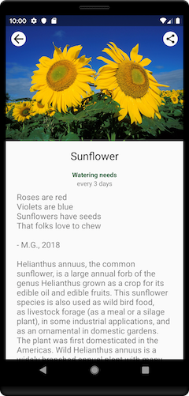

# Migrating Jetpack Compose de Vent

Esta pasta contém o código-fonte do codelab [Migrating to Jetpack Compose](https://developer.android.com/codelabs/jetpack-compose-migration).

O codelab que migra partes do [Sunflower](https://github.com/android/sunflower)'s Plant
details screen to Jetpack Compose is built in multiple GitHub branches:

* `main` é o ponto de partida do codelab.
* `end` contém a solução para este codelab.

## Pré-Requisitos
* Experiência com sintaxe Kotlin, incluindo lambdas.
* Conhecer o [básico de Compose](https://developer.android.com/codelabs/jetpack-compose-basics/).

## Começando
1. Instale o Android Studio [canary] mais recente(https://developer.android.com/studio/preview/).
2. Baixe a amostra.
3. Importe a amostra para o Android Studio.
4. Crie e execute a amostra.

## Capturas de tela
#### (Capturas do próprio [AndroidDeveloper](https://developer.android.com/?hl=pt-br))

